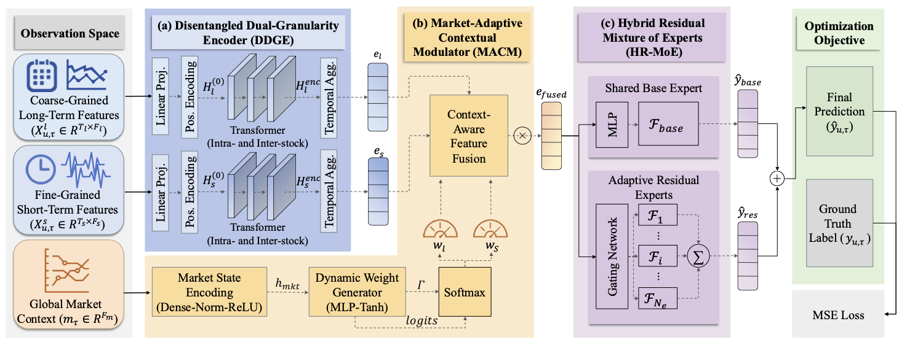
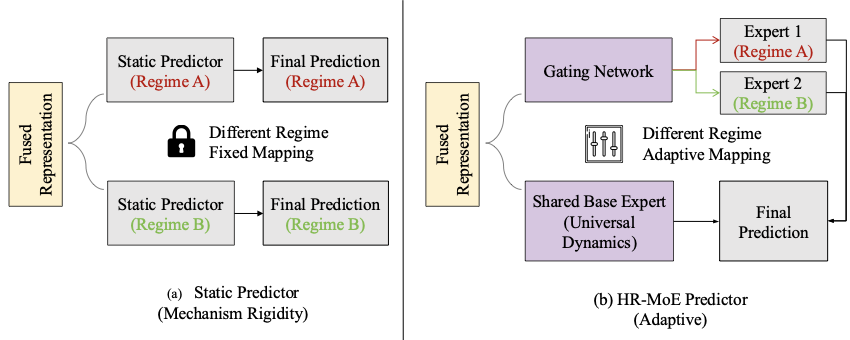

# DDGL-Net

<p align="center">
  <strong>Disentangled Dual-Granularity Learning for Regime-Aware Stock Return Forecasting</strong>
</p>

<p align="center">
  <a href="https://github.com/doitforlove/DDGL-Net"></a>
  <a href="LICENSE"></a>
</p>

DDGL-Net is a market-adaptive neural network for cross-sectional stock return forecasting. It separates transient, minute-derived signals from persistent daily trends, adapts their fusion to the current market context, and uses a residual mixture of experts to model regime-dependent return dynamics.

This repository provides a compact PyTorch implementation of the core architecture, daily cross-sectional training pipeline, checkpointing, prediction export, and IC-based evaluation.

> **Release scope.** The repository is intentionally model-centric. Raw market data, feature-generation scripts, baseline implementations, pretrained checkpoints, and the portfolio backtesting pipeline used in the paper are not included in this minimal release. See [What is included](#what-is-included) for details.

## Architecture

<p align="center">
  
</p>

DDGL-Net contains three main components:

1. **Disentangled Dual-Granularity Encoder (DDGE)**
   - Projects the fine- and coarse-grained inputs independently.
   - Applies sinusoidal positional encoding.
   - Models intra-stock temporal dependencies and inter-stock cross-sectional dependencies with separate temporal and spatial multi-head attention.
   - Uses attention-based temporal aggregation to produce one representation per stock and stream.

2. **Market-Adaptive Contextual Modulator (MACM)**
   - Encodes the current global market state.
   - Generates feature-wise weights over the short- and long-term representations.
   - Dynamically changes the contribution of each granularity instead of relying on a fixed concatenation or static gate.

3. **Hybrid Residual Mixture of Experts (HR-MoE)**
   - Uses a shared base expert to model stable, regime-invariant dynamics.
   - Uses a learned gate to combine adaptive residual experts.
   - Adds the gated residual forecast to the base forecast.

<p align="center">
  
</p>

For a trading date $\tau$, the model processes the entire valid stock cross-section together. This is important because the spatial attention layer learns dependencies between stocks within the same market snapshot.

## What is included

| Component | File | Purpose |
| --- | --- | --- |
| Configuration | `DDGLNET/config.py` | Model dimensions, lookback windows, optimization settings, device, and checkpoint path |
| Data utilities | `DDGLNET/data.py` | Pickle loading and one-trading-day-per-batch sampling |
| Core layers | `DDGLNET/layers.py` | Positional encoding, dual-granularity encoder, temporal aggregation, MACM, and HR-MoE |
| Full model | `DDGLNET/model.py` | Input splitting and end-to-end DDGL-Net forward pass |
| Training | `DDGLNET/trainer.py` | MSE optimization, validation, checkpointing, prediction, IC, ICIR, RankIC, and RankICIR |
| Command-line entry | `main.py` | Train/validation/test workflow and prediction export |

## Repository structure

```text
.
├── DDGLNET/
│   ├── __init__.py
│   ├── config.py
│   ├── data.py
│   ├── layers.py
│   ├── model.py
│   └── trainer.py
├── figures/
│   ├── ddgl_framework.png
│   ├── hr_moe.png
│   └── market_modulation.png
├── main.py
├── LICENSE
└── README.md
```

## Requirements

- Python 3.9 or later is recommended.
- PyTorch
- NumPy
- pandas
- SciPy (used by pandas for Spearman correlation)

CUDA is optional. The default device is CUDA when available and CPU otherwise.

## Installation

```bash
git clone https://github.com/doitforlove/DDGL-Net.git
cd DDGL-Net

python -m venv .venv
source .venv/bin/activate
python -m pip install --upgrade pip
python -m pip install torch numpy pandas scipy
```

If your system needs a specific CUDA build of PyTorch, install PyTorch using the command provided by the [official PyTorch installer](https://pytorch.org/get-started/locally/) before installing the remaining dependencies.


## Default configuration

| Parameter | Default | Description |
| --- | ---: | --- |
| `coarse_feat_dim` | 158 | Number of coarse-grained stock features |
| `fine_feat_dim` | 158 | Number of fine-grained stock features |
| `market_dim` | 60 | Number of global market-context features |
| `model_dim` | 256 | Latent representation dimension |
| `attention_heads` | 8 | Temporal/spatial attention heads |
| `dropout` | 0.5 | Dropout probability |
| `short_window` | 5 | Fine-grained lookback length |
| `long_window` | 30 | Coarse-grained lookback length |
| `num_experts` | 4 | Number of adaptive residual experts |
| `epochs` | 50 | Maximum training epochs |
| `learning_rate` | `1e-5` | Adam learning rate |

## Evaluation

The lightweight trainer reports predictive metrics computed across daily stock cross-sections:

- **IC:** mean daily Pearson correlation between predictions and labels.
- **ICIR:** mean daily IC divided by its temporal standard deviation.
- **RankIC:** mean daily Spearman rank correlation.
- **RankICIR:** mean daily RankIC divided by its temporal standard deviation.

NaN labels are masked in the MSE loss. Metric calculation removes prediction-label pairs containing NaNs and returns NaN for a day with fewer than two valid pairs.

Portfolio metrics reported in the paper—Annualized Return (AR), portfolio Information Ratio (IR), and Maximum Drawdown (MaxDD)—require a separate backtesting stack and are not computed by this repository. In particular, the code's `ICIR` is a predictive correlation statistic, not the portfolio `IR` reported in the paper.

## Paper results

The expanded study evaluates DDGL-Net on three Chinese equity universes and the S&P 500. The following are the reported mean results; refer to the paper for standard deviations, baseline comparisons, statistical tests, portfolio construction, and the full experimental protocol.

| Dataset | IC | ICIR | RankIC | RankICIR | AR | Portfolio IR | MaxDD |
| --- | ---: | ---: | ---: | ---: | ---: | ---: | ---: |
| CSI300 | 0.0728 | 0.4888 | 0.0806 | 0.5368 | 0.3396 | 2.7926 | -0.0535 |
| CSI500 | 0.0525 | 0.4403 | 0.0753 | 0.6227 | 0.2656 | 2.3643 | -0.0910 |
| CSI800 | 0.0552 | 0.4430 | 0.0755 | 0.5856 | 0.3536 | 2.6374 | -0.0812 |
| S&P 500 | 0.0636 | 0.2972 | 0.0627 | 0.2891 | 0.2627 | 0.4162 | -0.3655 |

These values are **paper-level results**, not a promise that running the minimal repository without the same data preparation and backtesting protocol will reproduce the table exactly.

## Disclaimer

This code is provided for research and educational purposes only. It is not investment advice and should not be used as the sole basis for financial decisions. Historical predictive or backtesting performance does not guarantee future results.
